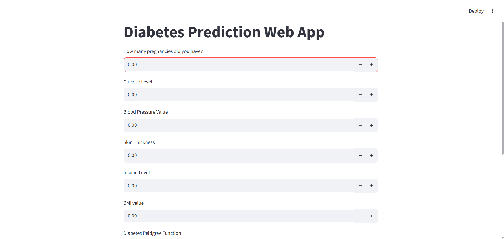
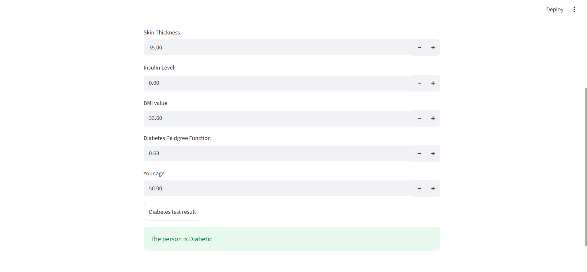
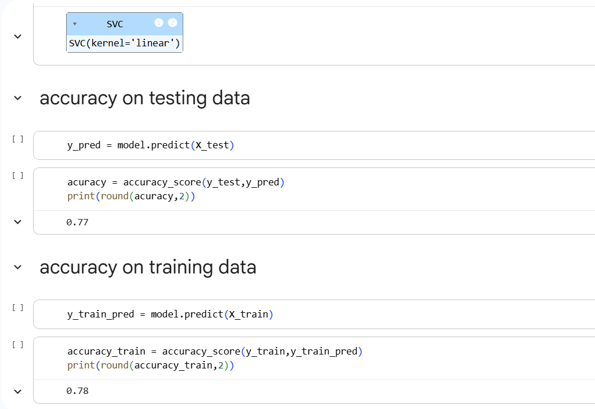

# Diabetes Prediction Web Application using Logistic Regression and Streamlit

## Overview

This project predicts whether a person is diabetic based on medical attributes using a Logistic Regression model. A Streamlit web application is used to provide an interactive user interface for predictions.

## Technologies Used

- Python
- NumPy
- Pandas
- Scikit-Learn
- Streamlit
- Pickle

## Dataset

The PIMA Indians Diabetes Dataset contains medical diagnostic measurements used to predict whether a patient has diabetes.The project uses the PIMA Indians Diabetes Dataset.

## Features

- Interactive Streamlit Web App
- Real-time Predictions
- Trained Machine Learning Model
- User-friendly Interface

## Project Structure

## Project Structure

```text
diabetes-prediction-streamlit/
│
├── dataset/
│   └── diabetes.csv
│
├── notebook/
│   └── Diabetes_Prediction.ipynb
│
├── screenshots/
│   ├── home.png
│   ├── prediction.png
│   └── model_accuracy.png
│
├── app.py
├── trained_model.sav
├── requirements.txt
├── README.md
└── .gitignore
```

## Screenshots

## Home Page



## Prediction Result



## Model Performance



## How to Run

```bash
pip install -r requirements.txt
streamlit run app.py

## Model Performance

Model : SVM 
Accuracy: 77%

## Disclaimer

This project is developed for educational and demonstration purposes only. It should not be used as a substitute for professional medical advice or diagnosis.

## Author

Neil Kesarkar   
